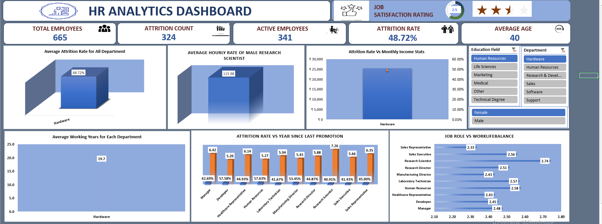

# HR-Analytics-Dashboard
HR Attrition Analysis using MYSQL, Excel, Power BI &amp; Tableau | 50,000+ records | 6 KPIs

# 📊 HR Analytics Dashboard

> Analyzing workforce attrition and HR KPIs using MySQL, Excel, Power BI, and Tableau across a 50,000+ record dataset.

---

## 📁 Project Overview

This project involves end-to-end HR data analysis on a large employee dataset split across two tables — **HR_1** (employee demographics & attrition) and **HR_2** (compensation & experience). The goal is to uncover attrition patterns, compensation trends, and workforce insights to support data-driven HR decision-making.

Key highlights:
- 50,000+ employee records analyzed
- 6 business KPIs designed and solved using SQL
- Interactive dashboards built in **Excel**, **Power BI**, and **Tableau**
- Dynamic filters by Department, Gender, and Education Field

---

## 🛠️ Tools & Tech Stack

| Category | Tools Used |
|---|---|
| Database & Querying | MySQL |
| Data Analysis | Excel (Pivot Tables, Power Query) |
| Visualization | Power BI (DAX), Tableau |
| Skills Applied | Data Cleaning, KPI Development, Dashboard Design, EDA |

---

## 📌 KPIs Analyzed

### KPI 1 — Average Attrition Rate for All Departments
Calculated the attrition percentage for each department to identify which teams have the highest employee turnover.

```sql
SELECT 
    Department,
    CONCAT(
        ROUND(
            AVG(CASE 
                    WHEN Attrition = 'Yes' THEN 1 
                    ELSE 0 
                END) * 100, 2
        ),
        '%'
    ) AS Attrition_Rate
FROM hr_1
GROUP BY Department;
```

---

### KPI 2 — Average Hourly Rate of Male Research Scientists
Filtered by job role and gender to compute the average hourly compensation for Male Research Scientists.

```sql
SELECT 
    JobRole,
    Gender,
    ROUND(AVG(HourlyRate), 2) AS Avg_Hourly_Rate
FROM hr_1
WHERE JobRole = 'Research Scientist'
  AND Gender = 'Male'
GROUP BY JobRole, Gender;
```

---

### KPI 3 — Attrition Rate vs Monthly Income Stats
Joined HR_1 and HR_2 to compare average, min, and max monthly income between employees who left vs. stayed.

```sql
SELECT 
    h1.Attrition,
    COUNT(*)                                                          AS EmployeeCount,
    ROUND(AVG(h2.MonthlyIncome), 2)                                   AS AvgMonthlyIncome,
    MIN(h2.MonthlyIncome)                                             AS MinMonthlyIncome,
    MAX(h2.MonthlyIncome)                                             AS MaxMonthlyIncome,
    ROUND(
        (COUNT(*) * 100.0) / SUM(COUNT(*)) OVER (), 2
    )                                                                 AS AttritionRate_Pct
FROM HR_1 h1
JOIN HR_2 h2 ON h1.EmployeeNumber = h2.EmployeeID
GROUP BY h1.Attrition;
```

---

### KPI 4 — Average Working Years for Each Department
Analyzed employee tenure across total working years, years at company, and years in current role by department.

```sql
SELECT 
    h1.Department,
    COUNT(*)                                AS EmployeeCount,
    ROUND(AVG(h2.TotalWorkingYears), 2)     AS AvgTotalWorkingYears,
    ROUND(AVG(h2.YearsAtCompany), 2)        AS AvgYearsAtCompany,
    ROUND(AVG(h2.YearsInCurrentRole), 2)    AS AvgYearsInCurrentRole
FROM HR_1 h1
JOIN HR_2 h2 ON h1.EmployeeNumber = h2.EmployeeID
GROUP BY h1.Department
ORDER BY AvgTotalWorkingYears DESC;
```

---

### KPI 5 — Job Role vs Work-Life Balance
Compared work-life balance ratings (Poor / Fair / Good / Excellent) across all job roles.

```sql
SELECT 
    h1.JobRole,
    COUNT(*)                                                          AS EmployeeCount,
    ROUND(AVG(h2.WorkLifeBalance), 2)                                 AS AvgWorkLifeBalance,
    SUM(CASE WHEN h2.WorkLifeBalance = 1 THEN 1 ELSE 0 END)           AS Poor,
    SUM(CASE WHEN h2.WorkLifeBalance = 2 THEN 1 ELSE 0 END)           AS Fair,
    SUM(CASE WHEN h2.WorkLifeBalance = 3 THEN 1 ELSE 0 END)           AS Good,
    SUM(CASE WHEN h2.WorkLifeBalance = 4 THEN 1 ELSE 0 END)           AS Excellent
FROM HR_1 h1
JOIN HR_2 h2 ON h1.EmployeeNumber = h2.EmployeeID
GROUP BY h1.JobRole
ORDER BY AvgWorkLifeBalance DESC;
```

---

### KPI 6 — Attrition Rate vs Years Since Last Promotion
Explored whether longer gaps since the last promotion are correlated with higher attrition rates.

```sql
SELECT 
    h2.YearsSinceLastPromotion,
    COUNT(*)                                                          AS TotalEmployees,
    SUM(CASE WHEN h1.Attrition = 'Yes' THEN 1 ELSE 0 END)            AS AttritionCount,
    ROUND(
        (SUM(CASE WHEN h1.Attrition = 'Yes' THEN 1 ELSE 0 END) * 100.0)
        / COUNT(*), 2
    )                                                                 AS AttritionRate_Pct
FROM HR_1 h1
JOIN HR_2 h2 ON h1.EmployeeNumber = h2.EmployeeID
GROUP BY h2.YearsSinceLastPromotion
ORDER BY h2.YearsSinceLastPromotion;
```

---

## 📸 Dashboard Screenshots

### Excel Dashboard


### Power BI Dashboard


### Tableau Dashboard


---

## 📂 Repository Structure

```
HR-Analytics-Dashboard/
│
├── datasets/
│   └── Hr_Analytics_Datasets.zip
│
├── sql/
│   └── HR_analytics_sql_solutions.sql
│
├── screenshots/
│   ├── excel_dashboard.png
│   ├── powerbi_dashboard.png
│   └── tableau_dashboard.png
│
└── README.md
```

---

## 👩‍💻 Author

**Nishita Thakur**  
Data Analyst | SQL | Power BI | Tableau | Excel | Python  
📧 nishitathakur30@gmail.com  
🔗 [LinkedIn](your-linkedin-url) | [GitHub](your-github-url)
